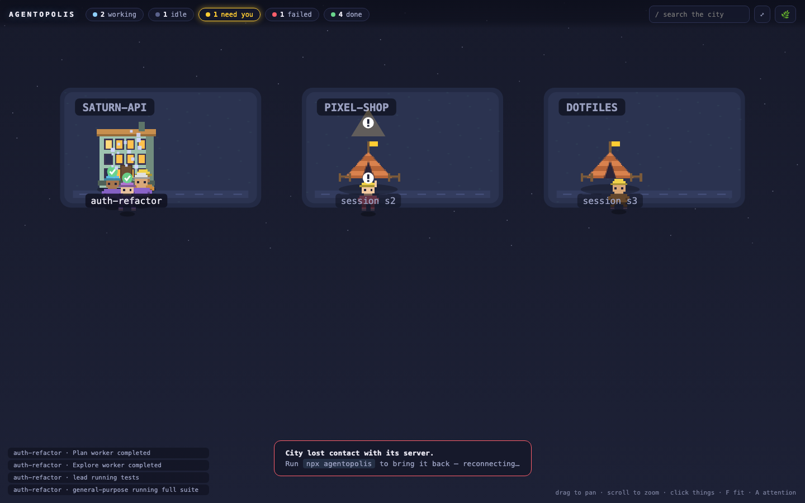

# Agentopolis

**Your Claude Code sessions and subagents, live, as a pixel city on localhost.**




You run six sessions across three repos and a subagent swarm on top. Terminal tabs don't scale. Agentopolis turns all of it into a city you can read at a glance: which agents are working, what they're actually doing, and — most importantly — which one is standing there with its hand up, waiting for you.

## Try it in 10 seconds

```bash
npx agentopolis --demo
```

No hooks, no setup — a synthetic agent swarm builds the city so you can tour it. When you're ready for the real thing:

```bash
npx agentopolis
```

It asks once for consent to add observation hooks to `~/.claude/settings.json`, then opens `http://127.0.0.1:4114`. New Claude Code sessions appear as they start. Requires Node 18+ and Claude Code.

Flags: `--port <n>` (default 4114) · `--no-open` (don't launch the browser) · `--yes` (skip the consent prompt) · `--no-hooks` (never touch `~/.claude/settings.json` this run) · `--no-log` (no local event history).

## What you're looking at

| In your terminal | In the city |
|---|---|
| A repo (project directory) | A **district** |
| An unnamed session | A temporary **tent worksite** |
| An explicitly named session | A permanent **building** — renaming a session promotes its tent, construction animation included |
| A subagent | A pixel **worker** |
| What an agent is doing right now | Truthful activity states: *researching, editing, testing, building, running, committing, installing, planning, delegating* — derived from real tool calls, never invented |
| A session waiting on permission or input | A pulsing **beacon** over the building and a worker with its hand raised |

Sessions that end leave their building standing with the lights off. The city persists across restarts (`~/.agentopolis/city.json`), so your districts and buildings keep their places.

## How it works

Claude Code hooks fire on session and tool events. Each one pipes through a tiny bridge that redacts the payload down to metadata, hands it to the local server, and exits 0 — always. Hooks are registered `async`, the bridge caps its local POST at under a second, and any failure is swallowed silently: Claude never waits on Agentopolis and never sees it fail.

```
Claude Code sessions
     │  hook events (SessionStart, PreToolUse, Stop, …)
     ▼
hook bridge (~/.agentopolis/bridge/hook.mjs)
     │  redact → metadata only, at the edge, before anything touches disk
     │  POST /hook ──── server down? ──▶ spool to ~/.agentopolis/spool
     ▼
localhost server (127.0.0.1 only)  ◀── reconciler: `claude agents --json`
     │  normalized events → reducers → world state ⇄ city.json
     ▼  SSE world snapshots
your browser: canvas pixel city
```

Hooks are best-effort by nature, so a reconciler periodically asks Claude Code for the authoritative session list (`claude agents --json`) and emits repair events for anything hooks missed — discoveries, renames, status changes, disappearances. The event vocabulary is a small provider-neutral protocol; see [docs/PROTOCOL.md](docs/PROTOCOL.md).

## Privacy

The promise: **everything stays on your machine, and only metadata exists in the first place.** Redaction happens in the bridge, before any event is sent or spooled — the server, the disk, and the browser only ever see the sanitized form.

**Stored** (locally, under `~/.agentopolis`, directory mode `0700`):
- Session IDs, project paths, session names
- Tool names and activity classifications ("editing", "testing", …)
- Safe display targets: file basenames, command previews sanitized to ≤ 80 chars with secret-shaped values masked — tokens, passwords, bearer headers, URL credentials, long base64 runs
- Timestamps, and a redacted local event history (`events-YYYY-MM-DD.jsonl`, pruned after 90 days; disable with `--no-log`)

**Never stored, never transmitted:**
- File contents, diffs, `old_string`/`new_string`
- Prompts and assistant messages
- Tool responses, or any payload field outside the small metadata allowlist
- Anything, to anywhere: the server binds to `127.0.0.1` only — no cloud, no telemetry, no analytics

**Leaving:** `npx agentopolis --uninstall` removes the hooks from `~/.claude/settings.json` and the bridge from your machine. Your local city history stays in `~/.agentopolis` until you delete that one folder — then every trace is gone.

## Keyboard & controls

| Input | Action |
|---|---|
| Drag | Pan the city |
| Scroll | Zoom |
| Click a building or worker | Open the inspector |
| `F` | Fit the whole city in view |
| `A` | Toggle the attention drawer (everything waiting on you) |
| `/` | Search |
| `Esc` | Close panels / clear selection |

## FAQ

**Does it slow Claude Code down?**
No. Hooks are registered with `"async": true`, so Claude doesn't wait on them at all. The bridge itself reads stdin, redacts, makes one localhost POST capped at 900 ms, and exits 0 unconditionally — even a wedged server costs a background process about a second, invisible to your session.

**Does it work with providers other than Claude Code?**
Not yet, but the event protocol is provider-neutral by design — adapters translate native signals into a small normalized vocabulary, and nothing past the adapter knows or cares where events came from. Adapters welcome: [docs/PROTOCOL.md](docs/PROTOCOL.md).

**I already have hooks in settings.json. Will it clobber them?**
No. The installer merges non-destructively — it appends its own entries and never touches anyone else's, after backing up your settings to `settings.json.agentopolis-backup-<timestamp>`. Uninstall removes only entries whose command path contains `.agentopolis`.

**What happens to events while Agentopolis isn't running?**
The bridge spools redacted payloads to `~/.agentopolis/spool` (bounded at 500). On the next launch the city drains the spool, and the reconciler catches up on session state from `claude agents --json`. You come back to a city that's current, not frozen.

**Can I keep an unnamed session as a permanent building?**
Yes — click its tent and hit **Pin as permanent building** in the inspector. (Renaming the session in Claude Code does the same thing, with more ceremony.)

## Roadmap

- **Act from the city** — approve or deny permission requests without finding the right terminal tab
- **Desktop app** (Tauri) — dock icon, native notifications
- **More providers** — Codex, Gemini CLI, Cursor, via protocol adapters
- **Mini mode** — tiny always-on-top city for the corner of your screen

---

MIT © [otniel-bit](https://github.com/otniel-bit/agentopolis). Built for people who run too many agents at once.
